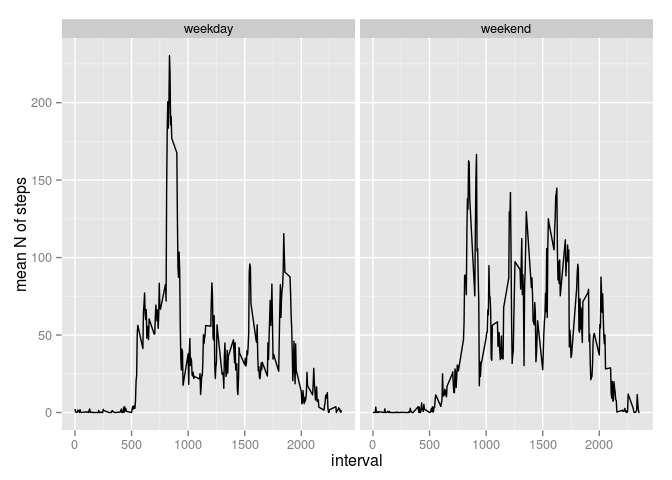

# Reproducible Research: Peer Assessment 1


## Loading and preprocessing the data

Below, I upload the data, and store it in a data frame.
Also, I load two libraries: *ggplot2* (for plotting) and *dplyr* (for subsetting data frames). 

```r
library(ggplot2,quietly=TRUE)
library(dplyr,quietly=TRUE,warn.conflicts=FALSE)
Sys.setlocale("LC_TIME", "C") # I needed this because weekdays() returned weekday names in my native language, not in English

data <- read.csv(unz("activity.zip", "activity.csv"))
data.DF <- data.frame(steps=data$steps,date=as.Date(data$date),interval=data$interval)
```

I transformed the values in the *date* column into *Date* objects.

## What is the mean total number of steps taken per day?

```r
days <- unique(data.DF$date)
totSteps <- sapply(days, function(day) sum(data.DF[which(data.DF$date==day),]$steps))
qplot(totSteps, geom="histogram",binwidth=sd(totSteps,na.rm=T)/4,xlab="N of steps",ylab="count",main="Histogram of the total number of steps in a whole day")
```

 

The mean number of steps per day is **10766.2**, whereas the median is **10765.0**.

## What is the average daily activity pattern?


```r
intervals <- unique(data.DF$interval)
meanSteps <- sapply(intervals, function(interval) mean(data.DF[which(data.DF$interval==interval),]$steps,na.rm=T))
qplot(x=intervals,y=meanSteps,geom="line",xlab="interval",ylab="mean number of steps",main="The mean number of steps for given interval\nacross all days")
```

 

The largest mean number of steps was **206.170**, and it was observed for the **835** interval.

## Imputing missing values
First, let's see which rows contain NAs:

```r
which.NA <- which(!complete.cases(data.DF))
```

The number of rows containing NAs was **2304** (out of **17568** total number of rows).

Now, let's impute the NAs. I've substituted each NA for a given interval with the mean value of steps observed (and calculated above) for that interval:

```r
meanSteps.list <- as.list(meanSteps)
names(meanSteps.list) <- intervals
data.without.NAs.DF <- data.DF
for(na.row in which.NA) {
  data.without.NAs.DF[na.row,]$steps <- meanSteps.list[[as.character(data.DF[na.row,]$interval)]]
}
totSteps.no.NA <- sapply(days, function(day) sum(data.without.NAs.DF[which(data.DF$date==day),]$steps))
qplot(totSteps.no.NA, geom="histogram",binwidth=sd(totSteps,na.rm=T)/4,xlab="N of steps",ylab="count",main="Histogram of the total number of steps in a whole day\nfor data with imputed NAs")
```

 

Note, that I have created a new data frame *data.without.NAs.DF* for which the NAs were substituted.


The mean number of steps for data with imputed NAs per day was **10766.189**, whereas the median was **10766.189**. *This is VERY close to the values calculated for data without imputed NAs.*

## Are there differences in activity patterns between weekdays and weekends?

For this part I defined a tiny function *assign.weekday()*


```r
assign.weekday <- function(date) {
  output <- as.factor("weekday")
  if(weekdays(date)%in%c("Sunday","Saturday")) 
    output <- as.factor("weekend")
  output
}
```

which I use to create a new column (called *weekday*) in the *data.without.NAs.DF* data frame:


```r
data.without.NAs.DF$weekday <- sapply(data.without.NAs.DF$date, function(date) assign.weekday(date))
```

Then, I subset the data which were recorded during the weekend:


```r
data.subset.weekend.DF <- subset(data.without.NAs.DF,weekday=="weekend")
meanSteps.weekend <- sapply(intervals, function(interval) mean(data.subset.weekend.DF[which(data.subset.weekend.DF$interval==interval),]$steps,na.rm=T))
```

and data recorded during weekdays:


```r
data.subset.weekday.DF <- subset(data.without.NAs.DF,weekday=="weekday")
meanSteps.weekday <- sapply(intervals, function(interval) mean(data.subset.weekday.DF[which(data.subset.weekday.DF$interval==interval),]$steps,na.rm=T))
```

I combine the two in a *tmp.DF* data frame, which I use for plotting:


```r
tmp.DF <- data.frame(x=intervals,meanSteps=c(meanSteps.weekend,meanSteps.weekday),weekday=as.factor(c(rep("weekend",length(meanSteps.weekend)),rep("weekday",length(meanSteps.weekday)))))
p <- ggplot(tmp.DF, aes(x, meanSteps)) + geom_line() + facet_grid(.~weekday) + xlab("interval") + ylab("mean N of steps")
p
```

 

And that is my final result - there is a difference in activity patterns observed during weekends and weekdays. There is a higher peek for weekdays (for interval 835), and the activity is more "scattered" during the weekend.
